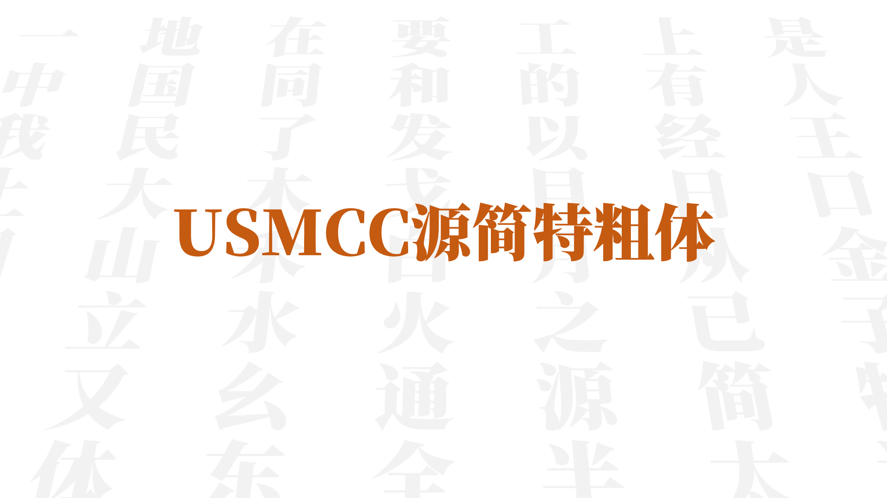
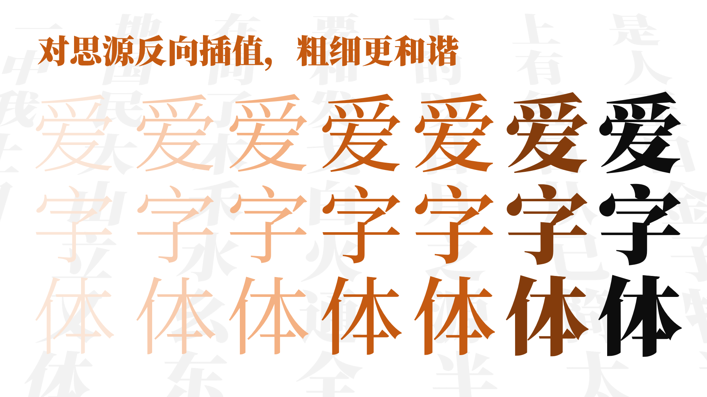
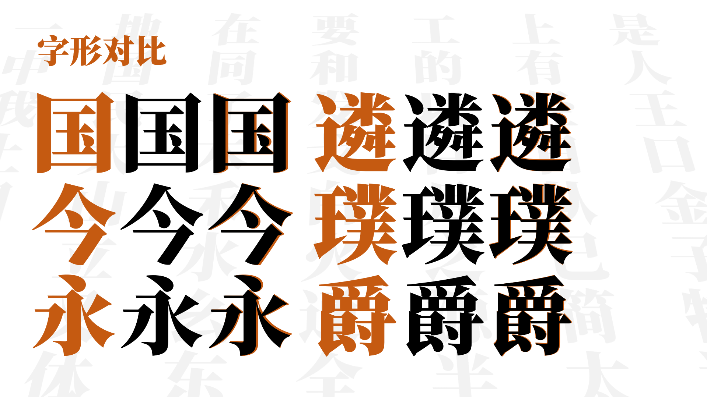
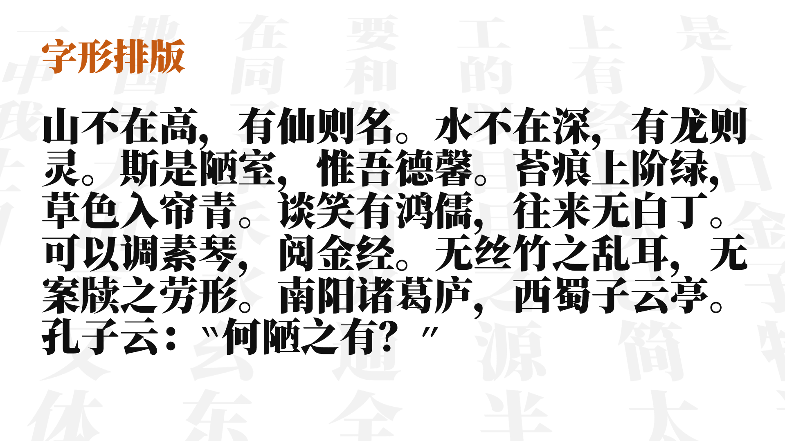
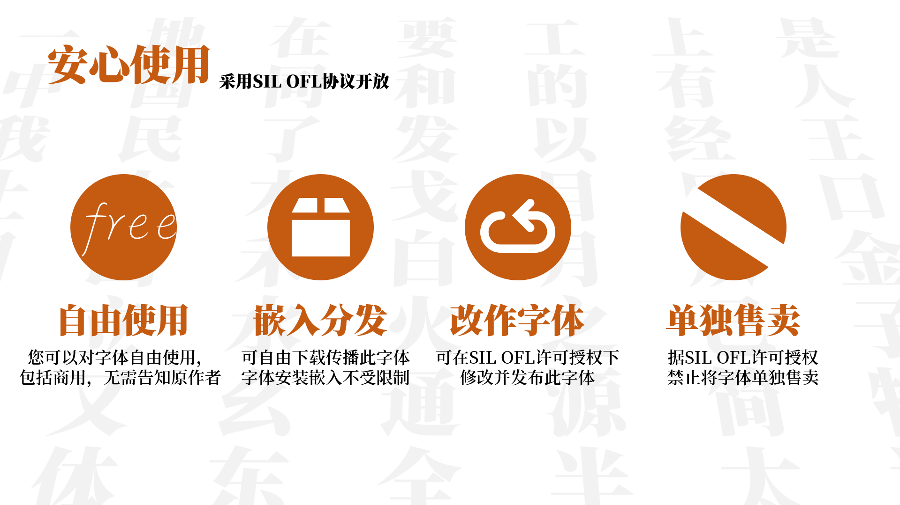
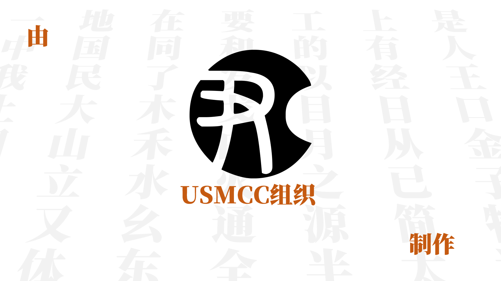
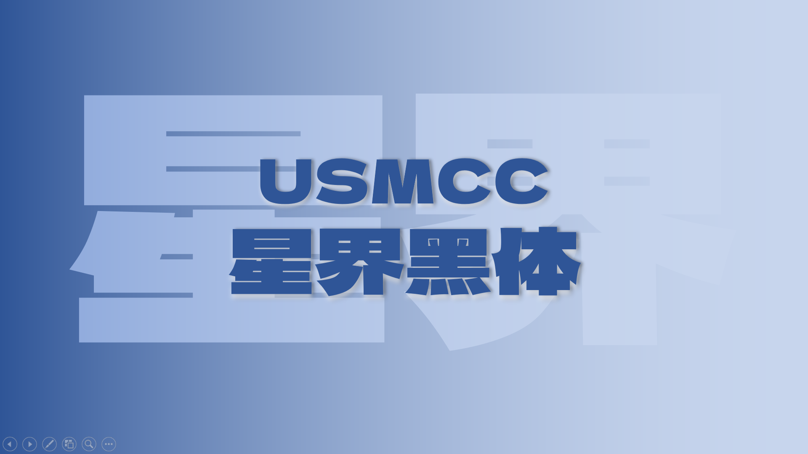

# USMCC所有字体

所有USMCC的字体都在此库中，由USMCC各成员制作，并且以USMCC的名称冠名，在此感谢各USMCC成员，也欢迎各位进行下载!

#### 目前所含字体

[USMCC源简特粗体](#USMCC源简特粗体)

[USMCC星界黑体](#USMCC星界黑体)

## USMCC源简特粗体
#USMCC源简特粗体

USMCC源简特粗体是由思源宋体反向插值制作的新字体，适用于标题等场所，可以较为和谐的和原有思源字重配合。

感谢：

思源宋体：https://github.com/adobe-fonts/source-han-serif

## USMCC星界黑体
#USMCC星界黑体

USMCC星界黑体/USMCC Stellar Gothic

基于由日本设计师 Artakana 于 2021 年所开源的字型「デラゴシック (Dela Gothic One / 德拉黑体)」，补充简繁体中文和注音符号等字符。目前本字体支援国字标准常用 (4808)、通用规范汉字表、GB/T 2312 及元素周期表的元素名称。

本字体亦在 SIL Open Font License v1.1 （SIL 开源字型授权，1.1 版）下公开发布，详细的授权条款可参阅SIL Open Font License 1.1。

本字体和デラゴシック、无界黑差异说明：考虑多语言使用和美术字/标题字定位，选择以日文（Adobe Japan）写法优先。在其基础上增加对于繁体中文更好的支持，同时优化部分简体字造型。对于デラゴシック中错误字图，均已经进行修复。

感谢：

デラゴシック：https://github.com/syakuzen/DelaGothic/

无界黑：https://github.com/maoken-fonts/unbounded-sans

字体设计：tsao tung

